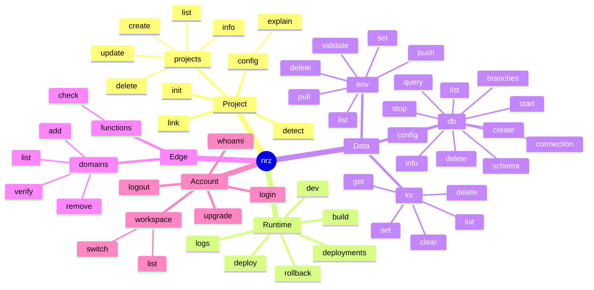

# Инвентаризация команд nrz-cli

Срез: 2026-06-21.

Проверено по текущему коду и help текущего debug-бинаря:

- `src/cli/mod.rs` - верхнеуровневый `Command` enum и глобальные флаги.
- `src/main.rs` - dispatch всех команд в handlers.
- `src/cli/*` и профильные modules (`deploy`, `build`, `dev`, `init`, `auth`).
- Endpoint-контракт DB/domains сверялся с текущим checkout `../deployment/packages/server`.
- `cargo build --quiet`.
- `target/debug/nrz --help` и help для основных вложенных команд.

Live API-команды не выполнялись. Это статический разбор текущей CLI-поверхности и handlers, не проверка доступности backend endpoints.

## Схема команд

## Глобальный контракт

Все команды принимают глобальные флаги:

| Флаг / env | Что делает |
| --- | --- |
| `--json`, `NRZ_JSON` | Машинный режим. Основной результат идет JSON-объектом в stdout, progress/status в JSON-mode пишется structured JSON lines в stderr. |
| `--human`, `NRZ_HUMAN` | Принудительно включает human output и подавляет auto-JSON. |
| `--token`, `NRZ_TOKEN` | Явный API token. |
| `--workspace`, `NRZ_WORKSPACE` | Workspace slug для выбора сохраненного токена/контекста. |

Важный runtime нюанс: если stdout не TTY, CLI сам включает JSON mode, если не передан `--human`.

`--env` больше не является root-level global flag. Он объявлен только там, где реально используется:

| Команда | `--env` / `NRZ_ENV` |
| --- | --- |
| `nrz deploy` | Target deploy environment: `production/prod` или `preview`. |
| `nrz env ...` | Target filtering/selection для platform env vars: `production`, `preview`, `development`. Флаг global внутри `env`, поэтому работает и после nested subcommand. |
| `nrz kv ...` | Local KV namespace. Default: `development`. Флаг global внутри `kv`, поэтому работает и после nested subcommand. |

`--project-id` унифицирован для project-scoped nested groups: у `db`, `env`, `domains` он объявлен global внутри группы и работает после nested subcommand (`nrz env validate --project-id ...`, `nrz domains list --project-id ...`, `nrz db query --project-id ...`).

## Верхнеуровневые команды

| Команда | Что умеет сейчас | Ключевые флаги / особенности |
| --- | --- | --- |
| `nrz dev [DIR]` | Запускает локальный dev server с ONREZA bootstrap, KV/context emulator и best-effort injection `DATABASE_URL` из managed DB. | `--alias`, `--command`, `--port`, `--inspect`, `--inspect-brk`, `--db-branch`. Команда запуска берется по приоритету: `--alias` -> `--command` -> `[dev].command`. |
| `nrz build [DIR]` | Находит output dir, валидирует `.onreza/manifest.json` или генерирует manifest для supported static/SSR outputs. | `--skip-validation`. |
| `nrz deploy [DIR]` | Основной deploy flow: install, build, detect, env validation, manifest/runtime artifact resolution, source bundle, functions payload, upload, polling live status. | `--prod`, `--env production|preview`, `--project-id`, `--skip-build`, `--skip-install`, `--build-command`, `--skip-env-check`, `--compute static|process`, `--health-check-path`, `--app` (`--filter` alias). Internal `--resume-deployment` скрыт из help. |
| `nrz detect [DIR]` | Определяет framework, package manager, runtime/build metadata, monorepo packages. | `--slug-only`, `--save`. Internal remote-detection flags `--stdin` и `--needed-files` скрыты из help. |
| `nrz config explain [DIR]` | Показывает effective build/deploy config с учетом root/app config, CLI override и server project settings. | `--app` (`--filter` alias), `--project-id`, `--local`. Без `--local` при наличии project id пытается fetch server settings. |
| `nrz init` | Создает local scaffold (`onreza.toml`, `.onreza/`, `.gitignore`) и опционально создает/линкует platform project. | `--name`, `--skip-detection`, `--create`, `--project-id`, `--local`. В JSON/non-interactive без `--create/--project-id` остается local-only. |
| `nrz link [DIR]` | Линкует текущую директорию к platform project и обновляет `onreza.toml`. | `--project-id`; в JSON mode обязателен, иначе interactive selection. |
| `nrz deployments` | Список deployments проекта. | `--limit` (1..100, default 10), `--project-id`. |
| `nrz logs` | Runtime logs проекта с фильтрацией. | `--deployment-id`, `--project-id`, `--limit` (1..1000, default 50), `--search`. |
| `nrz rollback` | Создает rollback deployment. | `--deployment-id`; если не задан, ищет текущий live deployment через `--project-id`/config. |
| `nrz functions check [DIR]` | Локальная проверка ONREZA Functions policy и `onreza.rules.toml`. | Ошибка `ONREZA_FUNCTIONS_NOT_FOUND`, если нет function entries и rules-файла; policy failure кодируется как `ONREZA_FUNCTIONS_POLICY`. |
| `nrz kv ...` | Локальный KV store для dev/emulator state. | Не ходит в API. Хранилище: `.onreza/data/kv.<env>.json` от текущей директории; default env namespace `development`. |
| `nrz db ...` | Managed PostgreSQL (kaiki) операции. | Management идет через `/v1/kaiki/databases`; project-scoped команды фильтруют/обновляют `projectAttachments`. `query` и `schema` получают connection URI через API и выполняют SQL локально из `nrz`. Database auto-resolve: explicit arg -> config `[db].database` -> auto-inject attachment -> первый attached DB. |
| `nrz env ...` | Управление platform env vars и локальными dotenv imports/exports. | `--project-id` global внутри `env`; target env берется из command-scoped `--env` для `list/set/push`. |
| `nrz domains ...` | Custom domain hostnames проекта через workspace-domain API. | `--project-id` global внутри `domains`; `add` по умолчанию ищет production environment и создает/переиспользует workspace domain zone. |
| `nrz projects ...` | CRUD projects через API. | `create --link` также пишет `onreza.toml` в cwd. |
| `nrz login` | Device flow login или сохранение explicit token. | Если передан `--token`, валидирует `/v1/user` и сохраняет workspace `personal`. |
| `nrz whoami` | Показывает текущего user и workspace context. | Требует token/workspace context. |
| `nrz logout` | Удаляет saved credentials. | `--all` чистит все workspaces; без `--all` удаляет выбранный/default workspace. |
| `nrz workspace ...` | Локальный список/switch сохраненных workspaces. | Не ходит в API. |
| `nrz upgrade` | Self-update из GitHub releases `onreza/nrz-cli`. | `--force`, `--version`, `--channel stable|beta`. |

## DB subcommands

| Команда | Назначение | Опции |
| --- | --- | --- |
| `nrz db list` | Список managed databases проекта. | `--project-id`. |
| `nrz db create` | Создает managed DB. | `--name`, `--cu-size`, `--wait`. |
| `nrz db info [DATABASE]` | Детали DB. | DB можно указать ID/name; иначе auto-resolve. |
| `nrz db delete <DATABASE>` | Удаляет DB. | `--force` для non-interactive/JSON. |
| `nrz db start [DATABASE]` | Запускает stopped DB. | DB optional, auto-resolve работает. |
| `nrz db stop [DATABASE]` | Останавливает running DB. | DB optional, auto-resolve работает. |
| `nrz db connection [DATABASE]` | Печатает connection string. | `--branch` для branch connection. |
| `nrz db query [SQL]` | Выполняет SQL локально с устройства через PostgreSQL connection URI. | API используется только для auth/project/database resolution и получения connection URI. `--database`, `--file`, `--branch`; если SQL и file не заданы, читает stdin. |
| `nrz db branches [list]` | Список branches. | `--database`; subcommand optional, отсутствие subcommand = `list`. |
| `nrz db branches create <NAME>` | Создает branch. | `--database`. |
| `nrz db branches delete <BRANCH>` | Удаляет branch по ID/name. | `--database`. |
| `nrz db branches connection <BRANCH>` | Печатает branch connection string. | `--database`. |
| `nrz db config [DATABASE]` | Показывает или меняет auto-inject settings. | `--auto-inject true|false`, `--env-var`, `--preview-branches true|false`. |
| `nrz db schema [DATABASE]` | Локальная интроспекция `public` schema через PostgreSQL connection URI. | `--branch`. |

Текущее DB-семейство - managed PostgreSQL. Старые D1/SQLite migration команды в текущем CLI отсутствуют.

## Env subcommands

| Команда | Назначение | Опции |
| --- | --- | --- |
| `nrz env list` | Список env vars проекта. | `--project-id`, command-scoped `--env` фильтрует selected targets. |
| `nrz env set <KEY> <VALUE>` | Создает/обновляет переменную. | `--secret`, command-scoped `--env` задает target environments. |
| `nrz env delete <KEY>` | Удаляет переменную. | `--project-id`. |
| `nrz env pull [FILE]` | Экспортирует env vars в dotenv file. | Default file: `.env.local`. |
| `nrz env push [FILE]` | Импортирует dotenv file на платформу. | `--overwrite`, `--dry-run`, `--secret`, `--declared-only`; default file: `.env.local`. |
| `nrz env validate` | Сверяет platform env vars с `[env.declarations]` в `onreza.toml`. | При missing required vars возвращает ошибку; `deploy` вызывает эту проверку pre-flight, если не задан `--skip-env-check`. |

Секретность при `env push`: `--secret` -> `[env.declarations]` visibility -> heuristic по имени (`KEY`, `SECRET`, `TOKEN`, `PASSWORD`, `PRIVATE`, `CERT`, `CREDENTIALS`).

## Project/account subcommands

| Команда | Назначение | Опции |
| --- | --- | --- |
| `nrz projects list` | Список projects. | `--limit` (1..100, default 20). |
| `nrz projects create --name <NAME>` | Создает project. | `--display-name`, `--git-url`, `--branch`, `--framework`, `--install-command`, `--build-command`, `--output-directory`, `--link`. |
| `nrz projects info <ID>` | Детали project. | - |
| `nrz projects update <ID>` | Обновляет project settings. | `--display-name`, `--git-url`, `--branch`, `--framework`, `--install-command`, `--build-command`, `--output-directory`, `--root-directory`, `--node-version`. Без полей падает. |
| `nrz projects delete <ID>` | Удаляет project. | `--force` для non-interactive/JSON. |
| `nrz workspace list` | Список локально сохраненных workspaces. | Local config only. |
| `nrz workspace switch <SLUG>` | Меняет default workspace. | Local config only. |

## Domains, KV, Functions

| Команда | Назначение | Опции |
| --- | --- | --- |
| `nrz domains list` | Список custom domain hostnames проекта из workspace-domain projection. | `--project-id`. |
| `nrz domains add <DOMAIN>` | Привязывает hostname к environment через workspace-domain API. | `--environment-id`; если не задан, ищет production environment; parent zone создается/переиспользуется сервером. |
| `nrz domains remove <DOMAIN_ID>` | Удаляет hostname binding. | `--project-id`. |
| `nrz domains verify <DOMAIN_ID>` | Запускает verify/check parent workspace domain zone для hostname binding. | `--project-id`. |
| `nrz kv get <KEY>` | Читает local KV value. | `--env`; expired values считаются отсутствующими. |
| `nrz kv set <KEY> <VALUE>` | Пишет local KV value. | `--env`, `--ttl`, default `0` без expiry. |
| `nrz kv delete <KEY>` | Удаляет local KV key. | `--env`. |
| `nrz kv list` | Список local KV keys. | `--env`, `--prefix`, `--limit` (default 100). |
| `nrz kv clear` | Удаляет весь local KV файл выбранного env namespace. | `--env`, `--force` обязателен для реальной очистки. |
| `nrz functions check [DIR]` | Проверяет local ONREZA Functions/rules payload до publish/deploy. | JSON output включает functions reports, edge rules report и policy error/code при нарушениях. |

## Найденные устаревшие или мертвые упоминания

В текущем `Command` enum и handlers нет неиспользуемых верхнеуровневых clap variants: все варианты из `src/cli/mod.rs` покрыты в `src/main.rs`.

Были найдены устаревшие упоминания команд в документации/skills; в рамках cleanup они удалены или заменены на актуальные команды:

| Упоминание | Где найдено | Статус сейчас |
| --- | --- | --- |
| `nrz db shell` | `README.md`, `docs/onreza-toml.md` | Команды нет в `DbCommand`; упоминания заменены. |
| `nrz db execute` | `README.md`, `skills/nrz-cli-env-db-kv/SKILL.md` | Команды нет; заменено на `nrz db query [SQL]`. |
| `nrz db migrate create/status/apply` | `README.md`, `skills/nrz-cli-env-db-kv/SKILL.md`, `skills/nrz-cli-deploy/SKILL.md` | Команд нет; упоминания удалены. |
| `nrz db migrate ... --remote` | skills | Команд и `--remote` флага нет; упоминания удалены. |
| `nrz db push` | `docs/onreza-toml.md` | Команды нет; упоминание удалено. |
| `nrz db reset --remote` | `skills/nrz-cli-ci-automation/SKILL.md` | Команды и `--remote` флага нет; упоминание удалено. |
| `[deploy].skip_migrations`, `[migrations]`, `[db].default_env` | `docs/onreza-toml.md` | В текущем `src/` не используются; удалены из docs. |
| `nrz env validate --project-id ...`, `nrz env push ... --project-id ...`, `nrz domains list --project-id ...` | skills/examples style | После перевода `--project-id` в group-global обе позиции работают; примеры оставлены валидными. |

Практический вывод: после cleanup текущая поверхность стала логичнее. Главные оставшиеся продуктовые решения, если они понадобятся позже: нужен ли отдельный интерактивный `db shell`, и нужно ли переносить local KV state из старого `.onreza/data/kv.json` в новый env-scoped файл автоматически.
